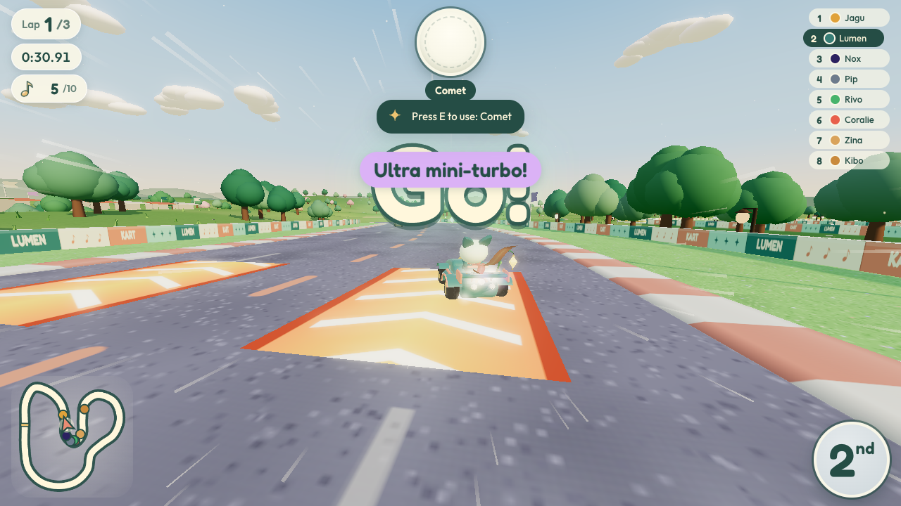
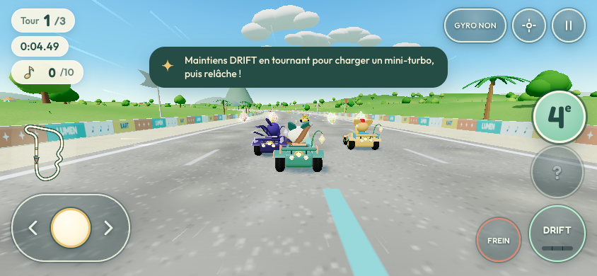
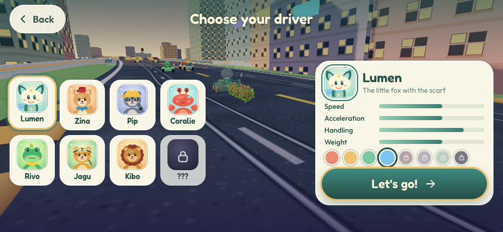

# Lumen Kart

**Un jeu de kart arcade en 3D avec Lumen, le petit renard à l'écharpe.**
Hors ligne, sans compte, sans publicité, sans traçage — pour iOS, Android et le web.



Lumen, héros du jeu de plateforme LUMEN, dispute des Grands Prix à travers huit mondes lumineux : prairies d'aurore,
lagons de corail, canopée d'Amazonie, dunes de Tozeur, Sidi Bou Saïd, la Ville des toits, la nuit des aurores et le
domaine de la Nuit. Tout — pilotes, karts, circuits, textures, musique et sons — est généré par le code.

## Points forts

- **8 pilotes** : Lumen, Zina la fennec, Pip le raton, Coralie la crabe, Rivo la grenouille, Jagu le jaguar,
  Kibo le lionceau et Nox, la Nuit (à débloquer).
- **8 circuits, 2 coupes** (Aube, Crépuscule), raccourcis, tremplins, ponts, créatures et chute dans les étoiles.
- **Modes** : Grand Prix (points, podium, trophées), course libre, contre-la-montre ; classes 50cc à 200cc et Miroir.
- **Conduite arcade** : drift à 3 niveaux (menthe, aube, comète violette), départ fusée, figures, aspiration,
  notes ♪ qui augmentent la vitesse de pointe.
- **13 objets** au thème de Lumen : ronce, graine, luciole, comète, fleur solaire, voile de nuit, aurore,
  plume d'envol, éclipse, étoile filante, résonance…
- **Pensé pour le mobile** : paysage, accélération automatique, inclinaison optionnelle, **aide à la direction**,
  vibrations, qualité graphique automatique, zones sûres.
- **Progression** : coupes, médailles, records, écharpes de couleur à débloquer avec les notes ; sauvegarde robuste.
- **Français et anglais**, navigation clavier et manette, réglage « Réduire les effets ».

| | |
|---|---|
|  |  |

## Démarrage rapide

Prérequis : **Node.js ≥ 22.12**.

```sh
npm ci                 # dépendances exactes
npm run dev            # serveur de développement Vite (aussi accessible depuis un téléphone du réseau local)
npm test               # 75 tests unitaires (Node, sans GPU)
npm run test:browser   # suite Playwright (npx playwright install chromium la première fois)
npm run build          # build de production dans dist/
npm run verify         # tests + build
```

### iOS et Android (Capacitor 8)

```sh
npm run native:sync    # build + copie dans les projets ios/ et android/ (avant tout build natif)
npm run ios            # ouvre Xcode
npm run android        # ouvre Android Studio
npm run android:apk    # APK de debug
npm run android:bundle # AAB signé pour Google Play (keystore requis)
npm run ios:simulator  # build simulateur non signé
```

Identifiant d'app : `com.omartrabelsi.lumenkart`. Signature, TestFlight et fiches boutique :
[`store/RELEASE_CHECKLIST.md`](store/RELEASE_CHECKLIST.md).

## Documentation

| Document | Contenu |
|---|---|
| [`docs/DOCUMENTATION.md`](docs/DOCUMENTATION.md) | **document principal** : jeu, contenu, progression, choix techniques, organisation, publication, feuille de route |
| [`docs/GAME_DESIGN.md`](docs/GAME_DESIGN.md) | bible de conception (fait foi) |
| [`ARCHITECTURE.md`](ARCHITECTURE.md) | contrat technique entre modules (anglais) |
| [`docs/GAMEPLAY.md`](docs/GAMEPLAY.md) | conduite, aide, objets et probabilités, IA, classes |
| [`docs/CIRCUITS.md`](docs/CIRCUITS.md) | circuits, coupes, format des définitions |
| [`docs/MOBILE_DESIGN.md`](docs/MOBILE_DESIGN.md) | cockpit tactile, inclinaison, qualité graphique |
| [`docs/NATIVE.md`](docs/NATIVE.md) | projets iOS / Android, plugins, signature, CI |
| [`docs/MULTIPLAYER.md`](docs/MULTIPLAYER.md) | mode en ligne (masqué par défaut) et relais WebSocket |
| [`docs/agents/`](docs/agents/) | rapports des agents (art, mondes, gameplay, UX, plateforme) |

## Licence et crédits

- Code sous licence **[MIT](LICENSE)** : © 2026 BridgeMind pour le moteur **Turbo Kart Rally**, © 2026 Omar Trabelsi
  pour Lumen Kart.
- Le nom *Lumen Kart*, le personnage de Lumen et l'art de marque ne sont pas concédés comme marques ; licences tierces
  (three.js, Capacitor, polices Fredoka et Outfit sous OFL…) dans [`NOTICE.md`](NOTICE.md).
- Lumen Kart est un **hommage original de fan** au kart arcade. Il n'est ni affilié à Nintendo ni approuvé par
  Nintendo, et n'utilise aucun de ses noms, personnages ou ressources.
