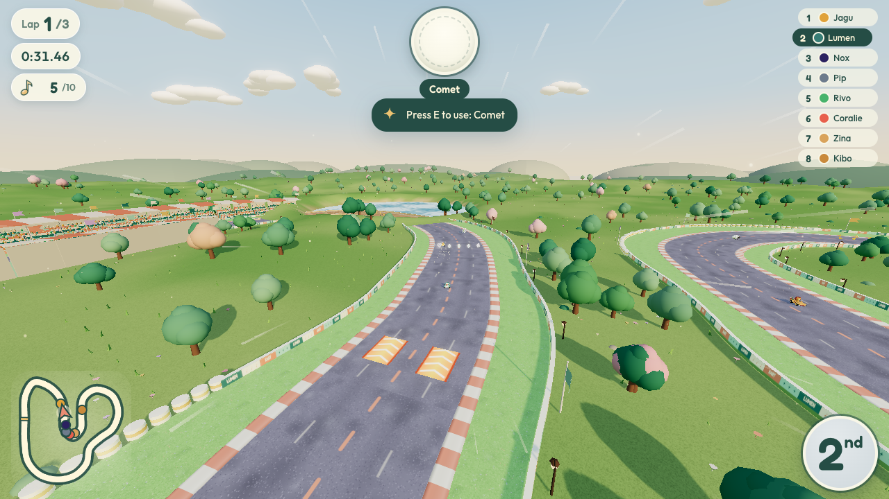
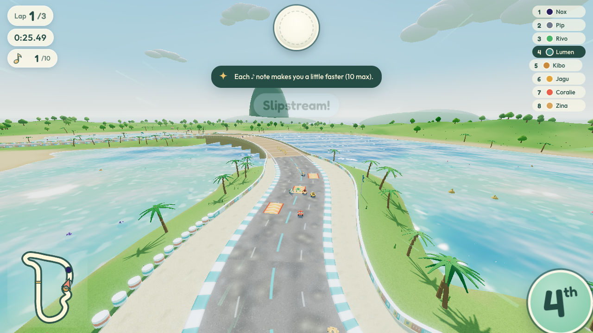
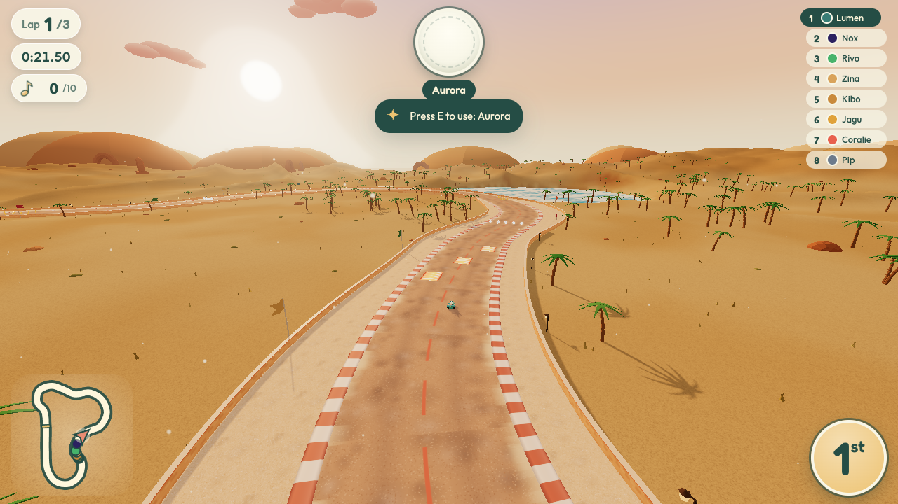
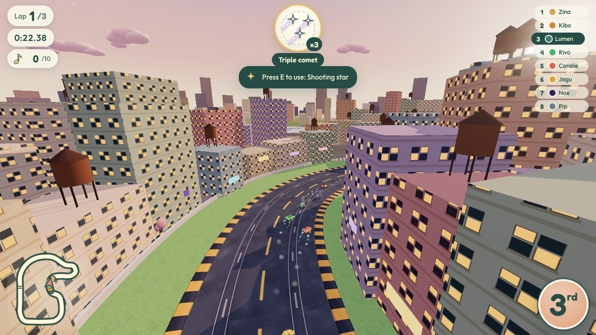
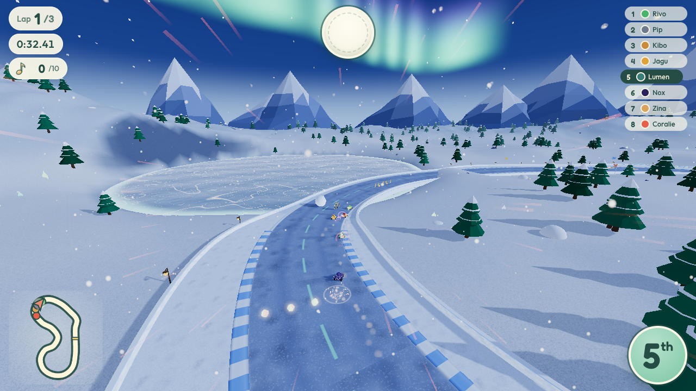

# Circuits et mondes

Les 8 circuits de Lumen Kart, leurs coupes et le format des définitions (`src/tracks.js`), plus le contrat du
générateur (`src/track.js`, `src/environment.js`). Rapport détaillé de l'agent Mondes : [`agents/worlds.md`](agents/worlds.md).

## Catalogue

| id | FR / EN | Monde (`theme`) | Coupe | Longueur | Tour IA 100cc* | Thème musical (`music`) |
|---|---|---|---|---|---|---|
| `meadow` | Prairies d'aurore / Dawn Meadows | `meadow` | Aube | 1 753 m | ≈ 47 s | `meadow` |
| `palm-cove` | Lagons de corail / Coral Lagoons | `lagoon` | Aube | 1 988 m | ≈ 54 s | `lagoon` |
| `jungle` | Canopée d'Amazonie / Amazon Canopy | `jungle` | Aube | 1 733 m | ≈ 45 s | `jungle` |
| `sunset-canyon` | Dunes qui chantent / Singing Dunes | `desert` | Aube | 1 959 m | ≈ 56 s | `dunes` |
| `medina` | Sidi Bou Saïd / Sidi Bou Said | `medina` | Crépuscule | 1 765 m | ≈ 46 s | `medina` |
| `city` | La Ville des toits / Rooftop City | `city` | Crépuscule | 1 807 m | ≈ 48 s | `city` |
| `frosty-peaks` | Nuit des aurores / Aurora Night | `aurora` | Crépuscule | 1 709 m | ≈ 50 s | `aurora` |
| `lava-keep` | Le Domaine de la Nuit / Realm of Night | `night` | Crépuscule | 1 926 m | ≈ 56 s | `night` |

\* temps du dernier des 8 IA (départ arrêté) dans `tests/gameplay.test.js` ; un bon joueur est ~10 % plus rapide.

Les ids sont **stables** (sauvegarde, réseau, tests) : quatre sont hérités de Turbo Kart Rally (`palm-cove`,
`sunset-canyon`, `frosty-peaks`, `lava-keep`) avec un nouveau thème ; quatre sont nouveaux. `getTrackDef('inconnu')`
renvoie `meadow`.

| Prairies d'aurore | Lagons de corail | Canopée d'Amazonie | Dunes qui chantent |
|---|---|---|---|
|  |  |  |  |
| **Sidi Bou Saïd** | **La Ville des toits** | **Nuit des aurores** | **Le Domaine de la Nuit** |
|  |  |  |  |

### Tracés
- **Prairies d'aurore** — montée vers la colline des lanternes, saut sur la crête, esses en descente, épingle dont
  l'intérieur est un **champ de fleurs ouvert (raccourci)** avec un pad de boost, retour par un pont de bois au-dessus
  de l'étang. Moutons endormis, pissenlits roulants.
- **Lagons de corail** — chaussée au milieu d'un lagon turquoise, ponton sur le récif, raccourci de banc de sable ;
  crabes qui traversent.
- **Canopée d'Amazonie** — pont de lianes sur la rivière, deux lacets jusqu'à 19 m (raccourci de fougères), course dans
  la canopée avec **saut de gorge** (trou de 12 m), descente devant la cascade ; grenouilles sauteuses.
- **Dunes qui chantent** — dunes de Tozeur au couchant, palmeraie, arches de grès, grands sauts ; rochers et
  virevoltants.
- **Sidi Bou Saïd** — ruelles pavées jusqu'à la falaise (17 m), place plate avec **jardin-raccourci**, saut de place,
  courbe le long de la baie jusqu'au port ; chats qui foncent puis se posent.
- **La Ville des toits** — rues à rails de tram, **viaduc à 12 m avec saut entre les toits** (trou de 13 m), raccourci
  par la place, pont sur le canal ; pigeons.
- **Nuit des aurores** — col enneigé sous des rubans d'aurore animés, lanternes, bonshommes de neige et boules de neige,
  descente rapide.
- **Le Domaine de la Nuit** — île flottante au-dessus d'un **vide étoilé** (`pitKind: 'void'`), château de cristal,
  écraseurs d'ombre, pont d'étoiles sans garde-corps.

## Coupes

```js
CUPS = [
  { id: 'dawn', names: { fr: 'Coupe de l’Aube', en: 'Dawn Cup' },       unlocked: true,
    tracks: ['meadow', 'palm-cove', 'jungle', 'sunset-canyon'] },
  { id: 'dusk', names: { fr: 'Coupe du Crépuscule', en: 'Dusk Cup' },   unlocked: false,  // podium en Aube
    tracks: ['medina', 'city', 'frosty-peaks', 'lava-keep'] },
];
GP_POINTS = [15, 12, 10, 8, 6, 4, 2, 1];
LEGACY_CUP_IDS = { turbo: 'dawn', reverse: 'dusk' };   // anciennes coupes Turbo Kart Rally, résolues par getCup()
```

Le mode **Miroir** inverse chaque circuit (`createTrack(..., { mirror: true })`) ; il se débloque en gagnant les deux
coupes.

## Format d'une définition (`tracks.js`)

| Champ | Rôle |
|---|---|
| `id`, `name`, `names {fr,en}`, `short`/`shorts`, `blurb`/`blurbs`, `color` | identité et textes de menu |
| `theme` | monde : `meadow`, `lagoon`, `jungle`, `desert`, `medina`, `city`, `aurora`, `night` (alias acceptés : `beach`, `snow`, `lava`) |
| `song` / `music` | chanson héritée existante / thème musical du monde lu par `audio.js` |
| `cp`, `scale` | points de contrôle de la ligne centrale (CatmullRom fermée) et échelle |
| placements en **cpf** (indice fractionnaire de point de contrôle) | plaques de boost, tremplins (suivis éventuellement d'un `gap`), rangées de prismes, lignes de notes, créatures |
| `lake` (`lake.open` = pont sans garde-corps) | plan d'eau / vide |
| `bridges: [{from, to}]` | viaduc ou passerelle (tablier, garde-corps, piles, pas de terrain dessous) |
| `shortcuts: [{from, to}]` | ouvre la barrière **intérieure** d'un virage sur un hors-piste de niveau (rampes en entonnoir aux deux bouts) |

Helpers : `trackName(def, lang)`, `trackBlurb(def, lang)`, `getCup(id)`, `getTrackDef(id)`.

## Contrat du générateur

`createTrack(scene, renderer, { def | trackId, mirror, quality })` — contrat complet dans
[`../ARCHITECTURE.md`](../ARCHITECTURE.md#1-worlds--srctracksjs-srctrackjs-srcenvironmentjs). Points clés :
- route de **24 m**, ≥ 8 places de départ, ≥ 4 rangées de prismes, notes sur la route, barrières hors de la route ;
- `getSurfaceInfo` renvoie `road | offroad | boost | jump | pit` (au-dessus d'un raccourci : `offroad`) ;
- `track.world` / `track.theme` (clé de monde), `track.pitKind` (`water` ou `void`), `track.shortcuts`, `track.gaps`,
  `getRespawnT(t)` (jamais dans un trou ni juste avant), `setShadowFocus(v)`.

## Rendu et qualité

- Ciel en dôme dégradé 4 couleurs (soleil ou lune en croissant, étoiles), brouillard teinté, terrain coloré par
  sommets, eau stylisée (caustiques, écume), glace craquelée (aurore) ou vide étoilé (nuit), arrière-plan par monde.
- Routes procédurales distinctes (`makeRoadTexture(world)`) : asphalte mauve doux, planches, terre rouge, sable tassé,
  pavés + frise bleue, rails de tram, neige damée, dalles indigo à étoiles dorées. Barrières aux couleurs du monde
  (panneaux « LUMEN KART ♪ ✦ », zellige, néon, blocs de glace…).
- Décor en `InstancedMesh` à matériaux partagés, géométrie statique fusionnée (`safeMerge()` ne lève jamais), chaque
  créature = 1 mesh, toutes les notes = 1 `InstancedMesh`. Monde = 45 à 55 objets dessinables (≤ ~75 appels avant
  culling).
- Qualité (`opts.quality` → `renderer.userData.quality` → `window.__lumenQuality`) :

| Niveau | Carte d'ombre | Terrain | Densité du décor |
|---|---|---|---|
| `high` | 2048 | 260² | 100 % |
| `medium` | 1024 | 200² | 60 % |
| `low` | 1024 (zone réduite) | 150² | 35 %, pas de foule, décor sans ombre |

La **géométrie de jeu est identique** à toutes les qualités (testé).

## Tests

`tests/circuits.test.js` (`npm test`) : 8 ids, 2 coupes de 4, alias, chanson existante, noms FR/EN ; pour chaque
circuit **et son miroir** : boucle fermée, largeur 24 m, 8 places, rangées d'objets, notes sur la route, barrières hors
route, pente praticable, pas de chevauchement, rampes = `jump`, trous = `pit`, réapparition hors trou, raccourcis
ouverts et de niveau, créatures et notes construites/animées/libérées sans GPU, nettoyage complet, qualité sans effet
sur le gameplay. Les dessins canvas sont simulés pour ce test ; l'apparence se vérifie dans le navigateur
(`docs/screenshots/track-*.png`).
