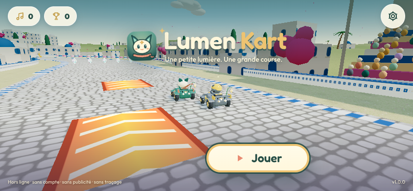
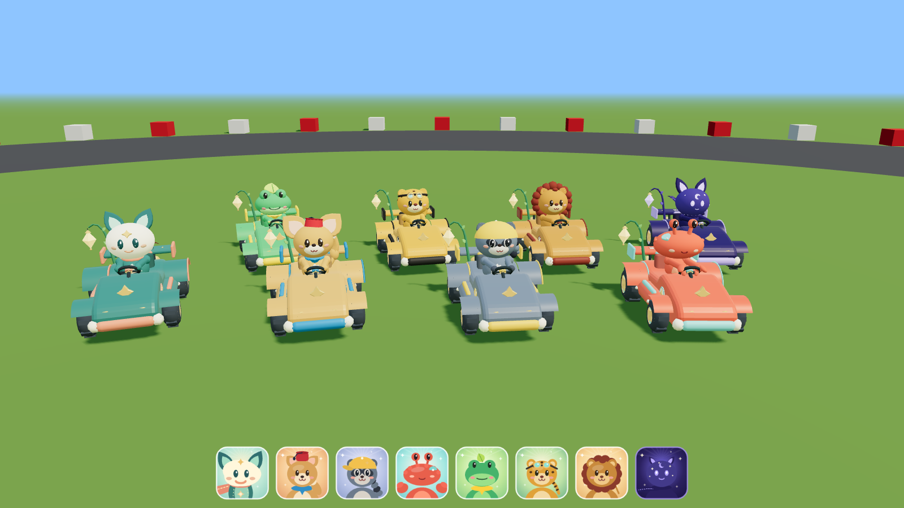
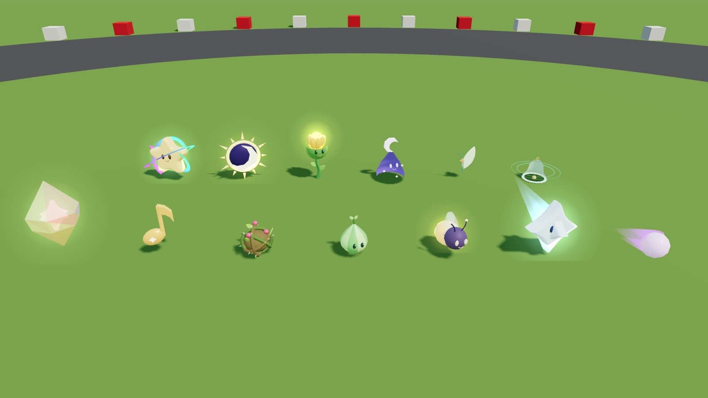
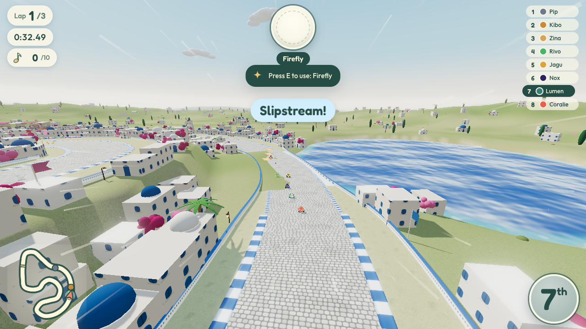
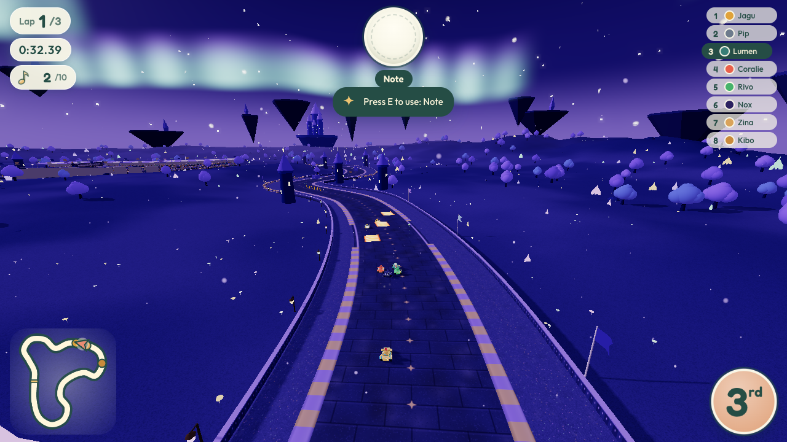
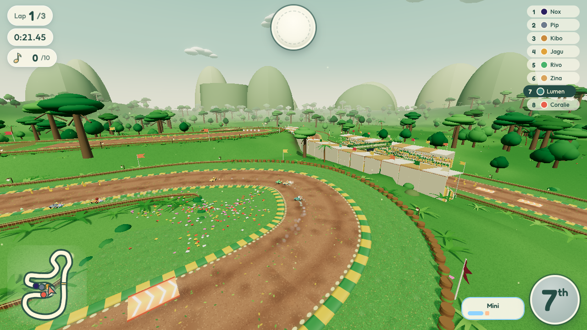
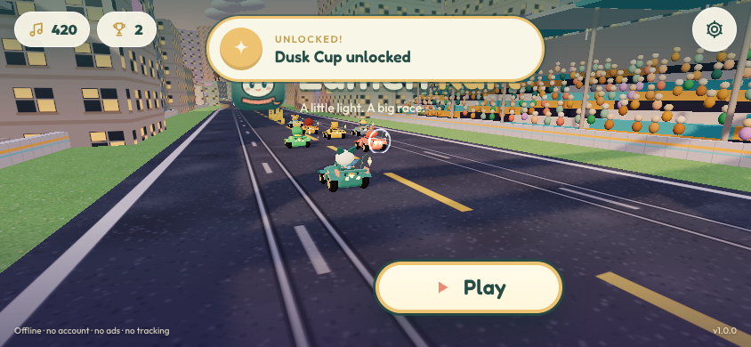

# Lumen Kart — Documentation du projet

> Document principal pour le propriétaire du projet et les futurs développeurs.
> Version du jeu : **1.0.0** · identifiant d'app : `com.omartrabelsi.lumenkart` · dernière mise à jour : 6 octobre 2026.



## Sommaire

1. [Présentation du jeu](#1-présentation-du-jeu)
2. [Comment jouer](#2-comment-jouer)
3. [Contenu](#3-contenu)
4. [Progression et sauvegarde](#4-progression-et-sauvegarde)
5. [Direction artistique et audio](#5-direction-artistique-et-audio)
6. [Choix techniques](#6-choix-techniques)
7. [Organisation du travail multi-agents](#7-organisation-du-travail-multi-agents)
8. [Structure du dépôt](#8-structure-du-dépôt)
9. [Développer, tester, construire, publier](#9-développer-tester-construire-publier)
10. [Limites connues et feuille de route](#10-limites-connues-et-feuille-de-route)
11. [Licences et crédits](#11-licences-et-crédits)

Documents liés : [`GAME_DESIGN.md`](GAME_DESIGN.md) (bible de conception, fait foi) ·
[`../ARCHITECTURE.md`](../ARCHITECTURE.md) (contrat technique, en anglais) · [`GAMEPLAY.md`](GAMEPLAY.md) ·
[`CIRCUITS.md`](CIRCUITS.md) · [`MOBILE_DESIGN.md`](MOBILE_DESIGN.md) · [`NATIVE.md`](NATIVE.md) ·
[`MULTIPLAYER.md`](MULTIPLAYER.md) · [`../store/RELEASE_CHECKLIST.md`](../store/RELEASE_CHECKLIST.md) ·
rapports des agents dans [`agents/`](agents/).

---

## 1. Présentation du jeu

### Concept
**Lumen Kart** est un jeu de kart arcade en 3D. **Lumen, le petit renard à l'écharpe**, héros du jeu de plateforme
LUMEN, dispute des Grands Prix à travers les mondes qu'il a traversés : prairies d'aurore, lagons, canopée d'Amazonie,
dunes de Tunisie, Sidi Bou Saïd, la Ville, la nuit des aurores et le domaine de la Nuit.

Le jeu reprend le moteur de **Turbo Kart Rally** (Three.js, licence MIT, © BridgeMind) : drift à 3 niveaux, objets
pondérés selon la position, Grand Prix, contre-la-montre, IA. Tout ce que le joueur voit et entend a été refait pour
l'univers de Lumen.

### Lumen
Petit renard bipède, rond et doux : pelage sarcelle `#387d76`, ventre menthe, grand visage crème, deux longues
**oreilles-feuilles**, grands yeux ovales qui clignent, étoile dorée à 4 branches sur le front et la poitrine.
Sa signature est l'**écharpe corail** `#e98c73` qui flotte derrière lui : elle s'allonge avec la vitesse, ondule en
drift et se soulève dans les airs. Son kart porte une lanterne en losange suspendue à une liane.



### Piliers
| Pilier | Ce que cela veut dire concrètement |
|---|---|
| **Fun immédiat au pouce** | on joue en 3 secondes, accélération automatique sur mobile, drift lisible, courses de 2 à 3 minutes ; le jeu pardonne (aide à la direction) mais récompense la maîtrise (mini-turbo violet, raccourcis, notes) |
| **Beau et lumineux** | couleurs pastel saturées, lumière dorée, ciels en dégradé, particules de lumière ; jamais sombre ni agressif, même dans la Nuit |
| **Mobile d'abord** | 60 i/s visés sur un téléphone milieu de gamme (iPhone 11 / Pixel 6), paysage, zones tactiles ≥ 48 px, hors ligne |
| **Qualité boutique** | progression (coupes, médailles, déblocages), réglages complets, FR/EN, sauvegarde robuste, aucune donnée collectée, classement PEGI 3 / 4+ |

### Public et plateformes
- **Public** : tout public (PEGI 3 / Apple 4+ / ESRB E), joueurs occasionnels sur téléphone comme amateurs de kart.
  Pas de violence réaliste : les « attaques » sont des ronces, graines, lucioles et pétales.
- **Plateformes** : iOS 15+ (iPhone et iPad), Android 7.0+ (API 24, cible API 36), navigateurs web récents
  (WebGL 2). Une seule base de code.
- **Modèle** : gratuit, **sans publicité, sans achat intégré, sans compte, sans traçage**, entièrement hors ligne.

---

## 2. Comment jouer

### Contrôles

**Mobile (paysage)** — l'accélération est automatique dès le « Partez ! ».


| Zone | Commande |
|---|---|
| Pouce gauche | pilule de direction ‹ › (glisser) ; ou **inclinaison** de l'appareil (bouton GYRO, réglage « Direction ») |
| Pouce droit | **Objet** (rond, affiche l'icône de l'objet), **Drift** (avec jauge de charge), **Frein** |
| Haut droite | GYRO oui/non, recentrer l'inclinaison, pause |

L'inclinaison est demandée depuis le geste « C'est parti ! » (autorisation iOS) ; la première lecture devient le neutre,
le braquage maximal est atteint à 24° d'inclinaison relative. Si l'autorisation est refusée, les commandes tactiles
restent disponibles.

**Clavier**

| Action | Touches |
|---|---|
| Accélérer / freiner (reculer) | W ou ↑ / S ou ↓ |
| Diriger | A/D ou ←/→ |
| Saut / drift | Espace (ou Maj droite) |
| Objet (maintenir = traîner derrière soi) | E, X ou Maj gauche |
| Regarder derrière (et tirer vers l'arrière) | C |
| Pause | Échap ou P |
| Couper le son | M |
| Menus | flèches, Entrée, Échap / Retour arrière |

**Manette** (mapping standard) : A ou RT accélérer · B ou LT freiner · stick gauche ou croix diriger (courbe expo
pour les petites corrections) · RB ou X drift · LB ou Y objet · L3/R3 regarder derrière · Start pause ; menus :
A/Start valider, B/Back retour. Le **bouton retour Android** suit la même logique (menu précédent, pause, reprise,
quitter depuis le titre).

### Drift et mini-turbo
1. Maintenez **Drift** et tournez : le kart fait un petit saut puis glisse (le drift s'engage même si vous tournez
   un peu tard, et à l'atterrissage d'un tremplin).
2. Les étincelles changent de couleur avec la durée : **menthe** (0,8 s) → **aube** (1,7 s) → **comète violette** (2,7 s).
3. Relâchez : mini-turbo de **0,5 s / 0,8 s / 1,15 s**. En 50cc la charge est 30 % plus rapide, en 100cc 15 %.

Autres techniques : **départ fusée** (clavier/manette : appuyer sur accélérer entre ~0,95 s et 0,2 s avant le
« Partez ! » ; trop tôt, le moteur cale — le mobile n'est jamais pénalisé), **figure** (drift en quittant un tremplin
→ petit boost), **aspiration** (rester dans le sillage d'un rival), plaques de boost et raccourcis.

### Notes ♪
Les pièces deviennent des **notes de musique dorées**. Chaque note tenue augmente un peu la vitesse de pointe
(10 au maximum, compteur « ♪ 7/10 »). Un choc en fait perdre 2 ou 3. Toutes les notes ramassées s'ajoutent aussi
à votre total de progression (voir §4).

### Objets
Les **prismes de lumière** donnent un objet tiré au sort selon votre position : le premier reçoit surtout des
objets défensifs, les derniers des objets de remontée. Tableau complet des probabilités dans [`GAMEPLAY.md`](GAMEPLAY.md).



| Objet (FR) | EN | id interne | Effet |
|---|---|---|---|
| Note | Note | `coin` | +2 notes et petit boost |
| Prisme de lumière | Light prism | `item_box` | boîte à objets (roulette) |
| Ronce / Triple ronce | Bramble | `banana` | piège posé derrière soi qui fait tourner ; la triple vous suit et sert de bouclier |
| Graine / Triple graine | Seed | `green_shell` | projectile droit qui rebondit sur les murs ; la triple orbite autour du kart |
| Luciole | Firefly | `red_shell` | projectile à tête chercheuse vers le kart devant |
| Comète / Triple comète | Comet | `mushroom` | ruée (boost) |
| Fleur solaire | Sunflower burst | `bomb` | explosion de pétales sur une zone |
| Voile de nuit | Night veil | `ghost` | intangible quelques secondes et vole l'objet d'un rival |
| Aurore | Aurora | `star` | invincible et plus rapide (7,5 s), arc-en-ciel d'aurore |
| Plume d'envol | Flight feather | `bullet` | pilote automatique en planant (jamais pour le top 2) |
| Éclipse | Eclipse | `lightning` | rétrécit tous les adversaires (5 s) |
| Étoile filante | Shooting star | `blue_shell` | vise le 1er (une seule en jeu, jamais pour le 1er) |
| Résonance | Resonance | `horn` | onde de choc autour de soi (l'appel de Lumen), détruit même l'Étoile filante |

Maintenir le bouton Objet permet de **traîner** une ronce ou une graine derrière soi comme bouclier.

### Aide à la direction
Réglage « Aide à la direction » : **Auto** par défaut (active en 50cc pour tous, et en 100cc pour les joueurs au tactile ; désactivée au clavier et à la manette dès le 100cc), **Toujours** ou **Jamais**. Quand elle est active :
- les mains libres, le kart suit la trajectoire idéale ; dès que le joueur tourne, il reprend la main ;
- un **garde-bord** corrige avant de quitter la route (même en drift ou en l'air) ;
- un **régulateur** lève le pied avant un virage trop rapide (sans jamais contredire un freinage) ;
- un **filet anti-chute** maintient le kart au-dessus des trous et ponts ouverts.

Validé par les tests : en 50cc et 100cc, « accélérateur seul + aide » boucle un tour sur les 8 circuits sans sortie
ni chute.

---

## 3. Contenu

### Les 8 pilotes
Statistiques de 1 à 5 (`src/config.js`, `CHARACTERS`). Le poids décide qui pousse qui lors des contacts.

| Pilote | Espèce / look | Vitesse | Accél. | Maniab. | Poids | Style IA |
|---|---|:-:|:-:|:-:|:-:|---|
| **Lumen** | renard, écharpe corail | 3 | 3 | 4 | 3 | équilibré |
| **Zina** | fennec de Tozeur, chéchia rouge | 2 | 4 | 5 | 1 | maîtresse du drift (vise le mini-turbo violet) |
| **Pip** | raton des toits, casquette à l'envers | 3 | 4 | 3 | 2 | opportuniste, fonce sur les prismes |
| **Coralie** | crabe des lagons, pinces sur le volant | 2 | 5 | 4 | 2 | prudente, évite bien les pièges |
| **Rivo** | grenouille d'Amazonie, casquette-feuille | 3 | 4 | 4 | 1 | nerveux, zigzague |
| **Jagu** | jaguar, lunettes d'aviateur | 5 | 2 | 3 | 3 | bolide, freine tard |
| **Kibo** | lionceau, crinière en pompons | 4 | 2 | 2 | 5 | cogneur, se colle aux rivaux |
| **Nox** | la Nuit : silhouette indigo étoilée, yeux lavande | 5 | 1 | 2 | 5 | rival agressif (à débloquer) |

### Les 8 circuits et 2 coupes


**Coupe de l'Aube** (ouverte dès le départ)

| Circuit | Monde | Longueur | Description |
|---|---|---|---|
| **Prairies d'aurore** | prairie, aube dorée | 1 753 m | collines vertes, cerisiers, lanternes et moutons endormis ; saut sur la crête, épingle avec **raccourci par le champ de fleurs**, pont de bois sur l'étang ; pissenlits roulants |
| **Lagons de corail** | lagon turquoise | 1 988 m | chaussée au milieu du lagon, coraux, paillotes sur pilotis, phare ; ponton au-dessus du récif, raccourci de banc de sable ; crabes qui traversent |
| **Canopée d'Amazonie** | jungle brumeuse | 1 733 m | pont de lianes sur la rivière, lacets jusqu'à 19 m (raccourci de fougères), **saut de gorge**, descente devant la cascade ; grenouilles sauteuses |
| **Dunes qui chantent** | désert de Tozeur au couchant | 1 959 m | dunes en croissant, palmeraie, arches de grès, mesas, grands sauts ; rochers et virevoltants |

**Coupe du Crépuscule** (débloquée par un podium en Coupe de l'Aube)

| Circuit | Monde | Longueur | Description |
|---|---|---|---|
| **Sidi Bou Saïd** | médina blanche et bleue | 1 765 m | ruelles pavées jusqu'à la falaise, bougainvilliers, **jardin-raccourci**, saut de place, grande courbe le long de la baie ; chats |
| **La Ville des toits** | ville au crépuscule pêche | 1 807 m | rails de tram, néons doux, **viaduc surélevé avec saut entre les toits**, raccourci par la place, pont sur le canal ; pigeons |
| **Nuit des aurores** | col enneigé, nuit bleue | 1 709 m | rubans d'aurore boréale animés, lune, sapins, igloos lumineux, lac gelé ; bonshommes de neige et boules de neige |
| **Le Domaine de la Nuit** | île flottante au-dessus du vide étoilé | 1 926 m | château de cristal flottant, dalles indigo à étoiles dorées, écraseurs d'ombre, pont d'étoiles brisé ; tomber = « chute dans les étoiles » |

Un tour dure environ 45 à 56 s (IA en 100cc). Tomber dans l'eau ou le vide : un **oiseau-lanterne** vous repêche.

| | | |
|---|---|---|
|  |  |  |

### Modes
| Mode | Règles |
|---|---|
| **Grand Prix** | 4 courses d'une coupe, points 15-12-10-8-6-4-2-1, classement entre les courses (le leader part en pole), podium et trophée or/argent/bronze par coupe et par classe |
| **Course libre** | n'importe quel circuit débloqué, 1, 2, 3 ou 5 tours |
| **Contre-la-montre** | seul en piste, 3 tours, une triple comète au départ ; meilleur temps total et meilleur tour enregistrés par circuit (et par miroir) |
| **En ligne** | conservé dans le code mais **masqué** dans les builds boutique (voir §6.13) |

### Classes
| Classe | Nom FR / EN | Vitesse | IA |
|---|---|---|---|
| 50cc | Balade / Stroll | ×0,86 | douce, aide à la direction activée par défaut |
| 100cc | Élan / Stride | ×1,00 | normale |
| 150cc | Comète / Comet | ×1,12 | difficile |
| 200cc | Aurore / Aurora | ×1,30 | extrême |
| Miroir | Miroir / Mirror | ×1,12, circuits inversés | difficile — se débloque en gagnant les deux coupes |

---

## 4. Progression et sauvegarde

### Déblocages
Les déblocages sont **calculés à partir des médailles et des notes**, jamais stockés : ils ne peuvent donc pas se
désynchroniser de la progression.

| Contenu | Condition |
|---|---|
| Coupe du Crépuscule (et ses circuits en course libre/CLM) | podium (top 3) en Coupe de l'Aube, n'importe quelle classe |
| Classe Miroir | victoire (1er) dans les deux coupes |
| **Nox** jouable | victoire dans la Coupe du Crépuscule (Nox court déjà comme rival IA) |
| Écharpes de Lumen | total de notes collectées (voir ci-dessous) |

### Écharpes
Les notes ramassées en course s'additionnent (monnaie cosmétique, **jamais dépensée**) et débloquent de nouvelles
couleurs d'écharpe pour Lumen, choisies dans l'écran Pilote.

| Écharpe | corail | or du matin | menthe | ciel | bougainvillier | comète | aurore | nuit étoilée |
|---|---|---|---|---|---|---|---|---|
| Notes cumulées | 0 | 60 | 150 | 300 | 500 | 750 | 1 050 | 1 400 |

Chaque déblocage (médaille, coupe, Miroir, pilote, écharpe) s'affiche sous forme de **carte de célébration** avec un
carillon.



### Médailles et records
- Meilleure place en Grand Prix par coupe et par classe (1 = or, 2 = argent, 3 = bronze).
- Records de contre-la-montre par circuit (`meadow`, `meadow:m` pour le miroir) : temps total, meilleur tour, pilote.
- Compteurs : courses, victoires, podiums.

### Schéma de sauvegarde (`src/save.js`)
Clé `lumenkart.save.v1` dans `localStorage`, **dupliquée dans Capacitor Preferences** sur iOS/Android (iOS peut vider
le stockage web d'une WebView ; la copie native est restaurée au démarrage).

```js
{
  version: 1,
  notes: 0,                        // notes ♪ collectées au total
  races: 0, wins: 0, podiums: 0,
  medals:  { dawn: { '100cc': 1 } },                          // meilleure place GP par coupe et classe
  records: { 'meadow': { time, lap, char }, 'meadow:m': {…} }, // contre-la-montre
  scarf: 'coral',                  // écharpe choisie (doit être débloquée)
  tutorial: { drift: false, items: false, notes: false },     // astuces de premier lancement déjà vues
  createdAt, updatedAt
}
```

Garanties : JSON illisible → copie de secours dans `lumenkart.save.v1.corrupt` puis sauvegarde neuve ; chaque champ
validé séparément (types, bornes) ; stockage indisponible (navigation privée) → aucune exception ; migration depuis le
format v0 et import des anciens records Turbo Kart Rally (`tkr-tt-*`). Les **réglages** sont à part
(`lumenkart.settings.v1`) ; « Effacer la progression » (double appui) remet la sauvegarde à zéro.

---

## 5. Direction artistique et audio

### Palette et style
L'identité vient de LUMEN (`src/theme.js`, jetons CSS dans `src/styles.css`) :

| Rôle | Couleur |
|---|---|
| Sarcelle (pelage de Lumen) / sarcelle profonde (fond d'app) | `#387d76` / `#1f4f4c` |
| Menthe / crème | `#99d1b7` / `#fff7dc` |
| Écharpe corail / or | `#e98c73` / `#edc371` |
| Nuit indigo | `#1c1640` |
| Auras de LUMEN : aurore, aube, comète | `#b5f3d0`, `#ffc193`, `#dbb2f6` |

- **3D** : formes rondes et trapues, couleurs de sommets pastel, éclairage chaud, ciels en dégradé à 4 couleurs,
  brouillard teinté. Les couleurs de drift (menthe, aube, comète) reprennent les pouvoirs de LUMEN. Aucune fumée noire :
  explosions en pétales, lavande ou crème.
- **Interface** : panneaux « papier » crème opaques à grands rayons, boutons d'encre sarcelle, pilules, animations
  courtes à rebond doux ; polices **Fredoka** (titres, chiffres) et **Outfit** (texte), embarquées.
- **Logo et icône** : visage de Lumen devant une roue de kart (`store/brand/icon.svg`), mot-symbole « Lumen *Kart* »
  avec l'étoile scintillante.

### Choix procéduraux
Tout est généré par le code, aucun modèle ni texture ni son importé :
- **Personnages et karts** : géométries Three.js fusionnées (`src/models.js`) ; portraits 2D et icônes d'objets dessinés
  sur canvas.
- **Mondes** : tracés définis par des points de contrôle, routes et barrières texturées par `CanvasTexture`
  (pavés et frise bleue à Sidi Bou Saïd, rails de tram en Ville, dalles étoilées dans la Nuit…), décor instancié.
- **Audio** (`src/audio.js`, WebAudio) : instruments synthétisés (marimba, kalimba, cloches, steel-pan, flûte ney,
  oud, piano électrique, nappes), **un thème par monde** (marimba pentatonique pour la Prairie, hijaz + ney + darbouka
  pour les Dunes, mixolydien + oud pour Sidi Bou Saïd, city-pop pour la Ville, cloches sur nappe pour les Aurores,
  dorien lumineux pour la Nuit), berceuse au titre ; tempo ×1,1 au dernier tour ; effets doux (carillon des notes qui
  monte avec le compteur, tic-tac de boîte à musique pour la roulette, grande cloche pour la Résonance, « boing » arrondi
  pour les chocs, carillon descendant pour la chute dans les étoiles).

---

## 6. Choix techniques

### 6.1 Pourquoi Three.js + Vite + Capacitor
| Besoin | Réponse |
|---|---|
| Une seule base de code pour iOS, Android et le web | le jeu est une app web ; **Capacitor 8** l'emballe dans une WebView native (WKWebView iOS 15+, Android System WebView ≥ 90) et donne accès aux API natives |
| Hors ligne | tout le JavaScript, les polices et icônes sont **dans le paquet de l'app** (`capacitor://localhost` / `https://localhost`) ; aucun CDN, aucune requête réseau en solo |
| Pas de moteur lourd | **Three.js r170** suffit pour un kart arcade stylisé ; pas de runtime Unity/Godot à embarquer, pas d'éditeur propriétaire, code lisible et testable sous Node |
| Moteur existant | Turbo Kart Rally (MIT) apportait déjà physique, IA, objets, GP : on a réhabillé au lieu de repartir de zéro |
| Taille du bundle | build actuel : `three` 530 kB (134 kB gzip), reste du JavaScript ≈ 550 kB (≈ 190 kB gzip) réparti en petits chunks, CSS 59 kB ; `dist/` complet ≈ 1,6 Mo polices et icônes comprises |
| Itération rapide | **Vite 8** (Rolldown) : rechargement à chaud en développement, build en ~0,1 s, découpage `three` / `three-addons` / `capacitor` |

Contreparties assumées : une WebView est moins performante qu'un moteur natif (pas d'accès direct à Metal/Vulkan,
ramasse-miettes JavaScript) — d'où les budgets stricts du §6.6 et la règle « aucune allocation par image ».

### 6.2 Pourquoi tout procédural
- **Zéro asset** : pas de modèles, textures ou musiques à produire, stocker ou charger ; l'app reste très légère.
- **Licences** : aucun risque de reprendre par erreur une ressource tierce (ou une IP Nintendo) ; tout est original.
- **Cohérence et variantes** : couleurs, niveaux de détail (LOD) et thèmes sont des paramètres ; une écharpe d'une autre
  couleur ou une qualité « basse » ne coûtent rien.
- Coût : la géométrie est générée au chargement d'une course (gabarits mis en cache par pilote × qualité).

### 6.3 Architecture modulaire et bus d'événements
- Un module par domaine (circuit, kart, IA, objets, effets, caméra, modèles, HUD, menus, audio…), avec un **contrat**
  écrit dans [`ARCHITECTURE.md`](../ARCHITECTURE.md) et un **propriétaire** par fichier.
- Les systèmes communiquent par un **bus d'événements** (`src/events.js`) : `kart:miniTurbo`, `item:hit`,
  `haptic`, `coin:pickup`… L'audio, le HUD, la caméra, les effets et la sauvegarde écoutent sans dépendre les uns des
  autres. Un gestionnaire qui plante est journalisé, jamais propagé.
- `main.js` charge les modules de jeu par `import()` dynamique et enveloppe chaque appel dans `safe()` : un module
  défaillant dégrade le jeu au lieu de le figer.

### 6.4 Simulation à pas fixe et déterminisme
- La physique avance par **pas fixes de 1/60 s** (`FixedStepper`, au plus 12 pas de rattrapage) quel que soit l'écran :
  60 Hz, 120 Hz ProMotion ou téléphone qui tombe à 30 i/s donnent la même course.
- `kart.js` n'utilise aucun `Math.random` ; les créatures bougent en fonction du temps de simulation. Résultat :
  tests reproductibles (`tests/simulation.test.js` vérifie le déterminisme du drift, de l'aide, du hit-stop, des murs
  et collisions), et base saine pour le mode en ligne (snapshots de l'hôte).

### 6.5 IA et rubber-banding
- Les IA suivent une trajectoire idéale avec anticipation, driftent dans les longs virages, évitent pièges et
  créatures, et utilisent les objets tactiquement.
- **Personnalités** par pilote (Zina drifte, Pip chasse les prismes, Kibo pousse, Nox est agressif…).
- **Élastique équitable et lissé**, par classe : une IA très en retard gagne au plus +3 % (50cc) à +12 % (150cc/200cc)
  de vitesse, une IA très en avance perd 7 % à 2 %. En 50cc il n'y a pas de « remontée flagrante » ; en 150cc le combat
  est réel. Simulation 3 tours × 8 circuits × 4 classes : 128/128 arrivées.

### 6.6 Performances mobiles
Objectif : 60 i/s sur iPhone 11 / Pixel 6.

**Budgets mesurés** (Chromium, `renderer.info`, passe d'ombre comprise) :

| Poste | Avant (Turbo Kart Rally) | Lumen Kart (haute) | moyenne | basse |
|---|---|---|---|---|
| Draw calls des 8 karts | ≈ 418 | **≈ 92** | ≈ 84 | ≈ 66 |
| Meshes par kart | 48–55 | **10–12** | 9–11 | 8–9 |
| Draw calls de 9 objets (banc) | ≈ 79 | **≈ 25** | ≈ 25 | ≈ 25 |
| Triangles par kart | 21,8–26,7 k | **≤ 12 k** | ≤ 6 k | ≤ 3 k |
| Banc de test complet (8 karts + 9 objets + décor) | 511 appels, 206 k triangles | **132 appels, 95 k** | 124, 51 k | 106, 27 k |
| Monde (piste + décor + créatures + notes) | — | 45–55 objets, ≤ ~75 appels avant culling | | |
| Triangles du monde (Prairie) | — | ~0,9 M | | ~0,3 M |
| Objets dessinables dans le groupe « objets » | 152–156 | **9–11** (prismes instanciés) | | |

Sources : `dev/models-test.html` (banc de l'agent Art) et mesures en course de l'agent Mondes/Gameplay (Chromium headless).
L'image complète en course mesurait ~210–270 appels **avant** la fusion des karts (dont ~100 pour la passe d'ombre) :
elle est à remesurer sur la build finale et sur appareil réel.

Techniques :
- **Un seul programme de shader** pour tout ce qui est statique dans les karts (couleurs et lueur par sommet),
  un mesh par groupe animé, 2 projeteurs d'ombre par kart (0 en basse : ombre-disque).
- **Instancing** partout : notes (1 `InstancedMesh`), prismes (`PrismBatch`), décor ; créatures = 1 mesh fusionné.
- **Particules en pools** (3 appels + anneaux et étoiles instanciés), tailles selon la qualité.
- **Qualité Auto / Haute / Moyenne / Basse** (`settings.js`) :

| Niveau | Pixel ratio mobile / bureau | Ombres | Bloom | Détail |
|---|---|---|---|---|
| Haute | ≤ 1,5 / ≤ 2 | douces, carte 2048 | bureau uniquement | complet |
| Moyenne | ≤ 1,25 / ≤ 1,5 | PCF, carte 1024 | non | ~60 % du décor, karts ≤ 6 k triangles |
| Basse | ≤ 1 | aucune (disques) | non | ~35 % du décor, karts ≤ 3 k triangles, pas d'animation de lanterne/yeux |

  *Auto* : téléphone → Moyenne (Basse si ≤ 3 Go de RAM ou ≤ 4 cœurs), ordinateur → Haute. En course, si le jeu reste
  sous 40 i/s pendant 4 s, la résolution baisse par paliers de 15 % jusqu'à 60 %.
- La **géométrie de jeu est identique** à toutes les qualités (testé) : la qualité ne change jamais le gameplay.
- Écran maintenu allumé, ProMotion activé (`CADisableMinimumFrameDurationOnPhone`), mode performance soutenue sur Android.

### 6.7 Internationalisation
`src/i18n.js` : dictionnaires FR/EN (~250 clés), `t(clé, {variables})`, repli anglais. Langue par défaut :
français si le navigateur/appareil est en français, sinon anglais ; changement **immédiat** dans les réglages
(menus, HUD, commandes tactiles, `<html lang>`). Noms de circuits, coupes, classes, objets et écharpes bilingues.
Le test `tests/i18n.test.js` vérifie que chaque clé existe dans les deux langues avec les mêmes variables. Textes iOS
natifs (autorisation de mouvement) localisés via `fr.lproj` / `en.lproj`.

### 6.8 Sauvegarde robuste
Voir §4 : sauvegarde versionnée, validée champ par champ, copie de secours en cas de corruption, miroir natif
(Preferences), migration, déblocages dérivés. Elle ne peut **jamais** faire planter le jeu.

### 6.9 Haptique et plugins natifs
- Le gameplay émet un événement `haptic` (impacts, mini-turbo, boost, atterrissage, mur, objet qui touche) **pour le
  joueur local uniquement** ; `src/native.js` le traduit en Capacitor Haptics (`impact` léger/moyen/fort,
  `notification SUCCESS`), limité à une vibration toutes les 60–90 ms, avec repli `navigator.vibrate`. Désactivable.
- Plugins : `@capacitor/app` (bouton retour, pause/reprise, quitter), `haptics`, `preferences`, `splash-screen`,
  `status-bar`, plus le plugin local **`TiltMotion`** (CoreMotion sur iOS, capteur de gravité sur Android) pour
  l'inclinaison. Accès toujours défensif : sur le web ou si un plugin manque, le jeu continue sans.

### 6.10 Orientation paysage
- iOS : paysage uniquement (iPhone et iPad), plein écran, barre d'état masquée, gestes système différés en bas d'écran.
- Android : `sensorLandscape`, `appCategory="game"`, plein écran immersif, exclusion des gestes sur la bande basse.
- Web : paysage recommandé, mais une mise en page portrait reste fonctionnelle (testée à 320×568).
- Zones sûres (encoche, Dynamic Island) via `env(safe-area-inset-*)` et les variables injectées par Capacitor.

### 6.11 Accessibilité
- Contraste encre sur papier ≈ 9:1, texte ≥ 11–12 px sur mobile, cibles tactiles ≥ 48 px.
- Tout est accessible au clavier et à la manette (focus spatial, anneau visible) ; `aria-label` traduits.
- **Réduire les effets** (et `prefers-reduced-motion`) : pas de lignes de vitesse, secousses de caméra réduites à 25 %,
  animations décoratives coupées — sans masquer d'information.
- La couleur n'est jamais le seul porteur d'information (ordinaux écrits, cadenas, libellés).
- **Aide à la direction** et accélération automatique pour les joueurs moins à l'aise.

### 6.12 Confidentialité
**Aucune donnée collectée.** Pas de compte, pas de publicité, pas d'analytics, pas de SDK tiers, pas de Firebase.
La sauvegarde reste sur l'appareil. Le jeu solo ne fait aucune requête réseau. Déclarations : App Store « Data Not
Collected » (`store/app-store-privacy.md`), Google Play « No data collected / shared »
(`store/google-play-data-safety.md`), `PrivacyInfo.xcprivacy` sans traçage. Permissions Android : `INTERNET`
(nécessaire à la WebView Capacitor et au mode en ligne optionnel) et `VIBRATE` — aucune boîte de dialogue.

### 6.13 Mode en ligne masqué (et pourquoi)
Le code multijoueur (salons privés par code, matchmaking public, relais WebSocket `server/index.js`) est conservé
mais **n'apparaît que si `VITE_WS_URL` est défini au build**. Il est masqué dans les builds boutique parce que :
- aucun serveur n'est déployé ni maintenu pour l'instant ;
- l'activer changerait les déclarations de confidentialité (pseudonymes, interactions entre joueurs) et le
  questionnaire de classification ;
- la simulation est **faite par l'hôte** (un hôte malveillant peut tricher), sans reconnexion ni migration d'hôte ;
- cela garde la promesse « hors ligne, sans compte » de la v1.

Détails et déploiement : [`MULTIPLAYER.md`](MULTIPLAYER.md).

### 6.14 Tests
| Niveau | Contenu | Commande |
|---|---|---|
| Unitaires (Node, sans GPU) | **75 tests** dans 7 fichiers : circuits (8 circuits + miroirs : boucle fermée, grille, objets, notes, pentes, trous, raccourcis, nettoyage), gameplay (aide, drift, mini-turbos, murs, hit-stop, probabilités d'objets, IA, courses complètes), simulation (déterminisme), sauvegarde, i18n, mobile (inclinaison, bouton retour), réseau (vrais clients WebSocket) | `npm test` |
| Navigateur (Playwright, Chromium) | 6 scénarios : course mobile 844×390 (tactile, drift, frein, pause), portrait 320×568 (avec rotation), petit paysage 568×320 (iPhone SE 1re gén.), changement de langue, Grand Prix complet jusqu'au podium, course en ligne à deux navigateurs | `npm run test:browser` |
| CI GitHub Actions | `verify.yml` (tests, contrôle boutique, build), `android.yml` (APK debug + AAB signé si secrets), `ios.yml` (build simulateur non signé) | automatique |

---

## 7. Organisation du travail multi-agents

Le jeu a été construit par une équipe d'agents spécialisés, coordonnés par la bible
[`GAME_DESIGN.md`](GAME_DESIGN.md) et le contrat [`ARCHITECTURE.md`](../ARCHITECTURE.md).

| Agent | Responsabilité | Fichiers possédés | Rapport |
|---|---|---|---|
| **Direction artistique** | Lumen et les 7 rivaux en 3D, karts, objets, portraits, icônes, oiseau-lanterne, budgets de rendu des karts | `src/models.js`, `src/kartfx.js` | [`agents/art.md`](agents/art.md) |
| **Mondes** | 8 circuits, 2 coupes, décors, routes, créatures, notes | `src/tracks.js`, `track.js`, `environment.js`, `track-textures.js`, `hazards.js`, `coins.js`, `tests/circuits.test.js` | [`agents/worlds.md`](agents/worlds.md) |
| **Gameplay** | sensations de conduite, aide à la direction, objets et probabilités, IA, caméra, effets, haptique | `src/kart.js`, `ai.js`, `items.js`, `effects.js`, `camera.js`, `input.js`, `config.js` (hors `CHARACTERS`), tests gameplay/simulation | [`agents/gameplay.md`](agents/gameplay.md) |
| **UX/UI, audio, flux** | menus, HUD, cockpit mobile, i18n, sauvegarde, réglages, musique et sons, accessibilité | `src/main.js`, `race.js`, `menu.js`, `hud.js`, CSS, `mobile-controls.js`, `audio.js`, `i18n.js`, `save.js`, `settings.js`, `native.js`, `icons.js`, `online-ui.js`, `index.html`, tests mobile/save/i18n | [`agents/ux.md`](agents/ux.md) |
| **Plateforme et publication** | identité d'app, Vite, projets iOS/Android, plugins, icônes, CI, serveur, Playwright, fiches boutique, licences | `package.json`, `capacitor.config.json`, `vite.config.js`, `ios/`, `android/`, `.github/`, `public/`, `server/`, `store/`, `tools/`, `Dockerfile`, tests réseau/navigateur | [`agents/platform.md`](agents/platform.md) |
| **Rédaction technique** | documentation | `README.md`, `ARCHITECTURE.md`, `docs/*.md` (hors `GAME_DESIGN.md` et `agents/`) | ce document |
| **Intégrateur** | arbitrage, revue, commits | — | — |

**Contrat de propriété** : chaque agent ne modifie que ses fichiers ; `src/theme.js`, `src/events.js` et
`GAME_DESIGN.md` sont partagés en lecture seule. Un besoin dans une autre zone se code contre le contrat d'API et se
signale dans le rapport (ex. : l'agent Mondes a signalé que `kart:fall` devait utiliser `track.pitKind`, corrigé
ensuite par l'agent Gameplay). Aucun agent ne commite ; `npm test` et `npm run build` doivent rester verts.

---

## 8. Structure du dépôt

```
lumen-kart/
├── index.html                 page unique (canvas WebGL + #ui-root), métadonnées PWA, préchargement des polices
├── package.json               scripts npm, dépendances exactes (three 0.170.0, Capacitor 8.5.2)
├── vite.config.js             base './', cibles es2022/safari15/chrome90, chunks three / three-addons / capacitor
├── capacitor.config.json      com.omartrabelsi.lumenkart, fond #1f4f4c, plugins SystemBars / StatusBar / SplashScreen
├── playwright.config.js       suite navigateur (build dédié .e2e-dist avec VITE_WS_URL + relais)
├── Dockerfile                 relais en ligne + build web sur un seul port (optionnel)
├── ARCHITECTURE.md            contrat technique entre modules (anglais)
├── LICENSE · NOTICE.md        MIT (BridgeMind + Omar Trabelsi) · licences tierces et marque
├── src/
│   ├── main.js                démarrage, rendu, qualité, machine à états, Grand Prix, progression, boucle
│   ├── config.js · theme.js · events.js · simulation.js   réglages, identité, bus, pas fixe
│   ├── tracks.js · track.js · environment.js · track-textures.js   catalogue, générateur de circuit, mondes, textures
│   ├── hazards.js · coins.js  créatures, notes ♪
│   ├── kart.js · ai.js · input.js   conduite, aide, IA, clavier/manette
│   ├── items.js · effects.js · camera.js   objets, particules, caméra de poursuite
│   ├── models.js · kartfx.js  pilotes, karts, objets, portraits, icônes, oiseau-lanterne, plume d'envol
│   ├── race.js · hud.js · menu.js · icons.js   course, HUD, menus, icônes SVG/canvas
│   ├── mobile-controls.js · native-motion.js · native.js   cockpit tactile, inclinaison, plugins Capacitor
│   ├── audio.js               musique et sons procéduraux (WebAudio)
│   ├── i18n.js · save.js · settings.js   langues, sauvegarde, réglages
│   ├── network.js · multiplayer-race.js · online-ui.js · online.css   mode en ligne (masqué)
│   └── styles.css · mobile.css
├── public/                    polices Fredoka/Outfit (+ licences OFL), icônes PWA, favicon, manifest
├── tests/                     *.test.js (node --test) + browser/racing.spec.js (Playwright)
├── dev/                       bancs d'essai interactifs (modèles, objets, conduite, circuit) d'origine
├── tools/                     generate-assets.mjs, validate-store.mjs, capture-store-screenshots.mjs
├── server/index.js            relais WebSocket borné (salons, matchmaking), sert aussi dist/
├── ios/                       projet Xcode (Swift Package Manager) : LumenKartViewController.swift (TiltMotion), Info.plist, PrivacyInfo
├── android/                   projet Gradle : MainActivity.java, TiltMotionPlugin.java, signature par variables d'environnement
├── store/                     métadonnées FR/EN, politique de confidentialité, questionnaires, check-list, brand/ (icône source)
├── .github/workflows/         verify.yml, android.yml, ios.yml
└── docs/                      cette documentation, GAME_DESIGN.md, agents/, screenshots/
```

---

## 9. Développer, tester, construire, publier

### Prérequis
- **Node.js ≥ 22.12** (toutes les commandes).
- iOS : Xcode 26 ou plus récent (build vérifié avec Xcode 27), compte Apple Developer pour signer.
- Android : Android Studio avec **JDK 21** et **SDK 36** (minSdk 24).
- Tests navigateur : `npx playwright install chromium` une fois.

### Commandes (`package.json`)
| Commande | Effet |
|---|---|
| `npm ci` | installe les dépendances exactes |
| `npm run dev` | serveur Vite (accessible sur le réseau local, utile pour tester sur téléphone) |
| `npm test` | 75 tests unitaires (`node --test tests/*.test.js`) |
| `npm run test:browser` | suite Playwright (construit `.e2e-dist/`, démarre le relais) |
| `npm run build` | build de production dans `dist/` |
| `npm run preview` | sert `dist/` |
| `npm run verify` | `npm test` puis `npm run build` |
| `npm run assets` | régénère icônes, splashs, icônes PWA et visuels boutique depuis `store/brand/icon.svg` |
| `npm run native:sync` | build + `cap sync` (iOS et Android) — **à lancer avant tout build natif** |
| `npm run ios` / `npm run android` | sync puis ouvre Xcode / Android Studio (alias : `native:ios`, `native:android`) |
| `npm run ios:simulator` | build iOS simulateur non signé (`xcodebuild`, `CODE_SIGNING_ALLOWED=NO`) |
| `npm run android:apk` | APK debug → `android/app/build/outputs/apk/debug/` |
| `npm run android:bundle` | AAB release signé (si keystore configuré) → `android/app/build/outputs/bundle/release/app-release.aab` |
| `npm run store:check` | vérifie fiches boutique, identité, version, permissions (`-- --release` : refuse les placeholders) |
| `npm run store:screenshots` | captures boutique aux tailles exactes (construit son propre bundle `.store-dist/` ; `--no-build` le réutilise) |
| `npm run server` | relais WebSocket optionnel (port 8787) |

Aide au débogage (uniquement en `npm run dev` ou dans un build `VITE_E2E=1` — **absente du build boutique**) : `__game.startRace({ gameMode: 'gp', cupId: 'dawn', classId: '50cc' })`,
`__game.startRace({ trackId: 'lava-keep', classId: '200cc' })`, `__game.fastForward(10)`, `__game.finishPlayer()`,
`__game.debug.autopilot = true`.

### Publier sur les boutiques (résumé de [`store/RELEASE_CHECKLIST.md`](../store/RELEASE_CHECKLIST.md))
1. **Avant soumission** : `npm ci && npm run verify`, `npm run test:browser`, `npm run store:check -- --release` ;
   remplacer `CONTACT_EMAIL` dans `store/privacy-policy.md` et publier la politique à une URL publique ; build **sans**
   `VITE_WS_URL` ; monter la version dans `package.json` **et** `MARKETING_VERSION` (Xcode) ; tester sur appareils réels
   (iPhone à encoche, iPad, Android milieu de gamme, tablette).
2. **Signature Android** : créer une fois la clé d'upload (`keytool -genkeypair … -alias lumenkart`), la sauvegarder hors
   du dépôt ; en local `android/keystore.properties` (ignoré par git) puis `npm run android:bundle` ; en CI, secrets
   `ANDROID_KEYSTORE_BASE64`, `ANDROID_KEYSTORE_PASSWORD`, `ANDROID_KEY_ALIAS`, `ANDROID_KEY_PASSWORD`. Activer
   **Play App Signing**.
3. **iOS** : App ID `com.omartrabelsi.lumenkart`, app créée dans App Store Connect ; `npm run ios` → Signing & Capabilities
   (équipe) → *Product › Archive* → *Distribute App › App Store Connect*. `ITSAppUsesNonExemptEncryption = NO` déjà réglé.
4. **Bêta** : **TestFlight** (groupe interne sans revue, jusqu'à 100 testeurs) ; Google Play **test interne**, puis
   **test fermé de 12 testeurs pendant 14 jours** pour un compte personnel récent avant la production.
5. **Fiches** : textes FR/EN dans `store/metadata/`, icône Play 512 et visuel 1024×500 dans `store/brand/`, captures
   (iPhone 6.9"/6.7", iPad 13", téléphone Play…) via `npm run store:screenshots`.
6. **Questionnaires** : confidentialité « aucune donnée », classification PEGI 3 / 4+ (`store/content-rating.md`),
   pas de publicité, statut de commerçant (DSA) dans l'UE.
7. **Après** : taguer `vX.Y.Z` (déclenche les workflows), surveiller Android vitals et Xcode Organizer.

### CI
| Workflow | Déclencheurs | Étapes |
|---|---|---|
| `verify.yml` | push `main`, PR, manuel | `npm ci`, `npm test`, `npm run store:check`, `npm run build`, artefact `dist/` ; job Playwright optionnel (manuel) |
| `android.yml` | push `main`, tags `v*`, PR touchant le natif, manuel | tests, build, `cap sync android`, APK debug ; AAB signé + vérification `jarsigner` si les secrets existent ; `versionCode` = numéro de run |
| `ios.yml` | push `main`, tags `v*`, manuel | tests, build, `cap sync ios`, build simulateur non signé (TestFlight automatisé non inclus) |

---

## 10. Limites connues et feuille de route

### Limites connues
| Domaine | Limite |
|---|---|
| Vérification | playtest QA complet en navigateur (voir [`agents/qa.md`](agents/qa.md)) ; **pas encore testé sur appareils réels** : 60 i/s et chauffe en qualité moyenne (Canopée, Lagons), inclinaison, haptique, encoche / îlot dynamique, bouton retour Android natif, audio dans WKWebView, repli `color-mix()` sur iOS 15–16.1 ; pas de lancement en simulateur iOS ; APK Android compilé seulement en CI |
| Publication | `CONTACT_EMAIL` à remplacer, URL de politique à confirmer, captures boutique à régénérer sur la build finale, statut de licence de l'art de marque (`store/brand/`) à décider |
| Art | bras cuits dans le torse (volant limité à ±0,45 rad) ; en qualité basse, lanterne fixe, yeux qui ne clignent pas, oreilles immobiles ; prisme transparent au tri approximatif de près ; nom sur l'aileron seulement en haute qualité |
| Mondes | bords des raccourcis invisibles (marqués par des haies) ; bord du vide en escalier (masqué par des falaises) ; façades instanciées identiques |
| Gameplay | l'aide ne gère pas les boosts (sorties brèves possibles en 200cc) ; hit-stop par kart seulement (pas de gel global) |
| Qualité | changer de qualité recompile les matériaux ; tailles des pools de particules et LOD des karts changent à la course suivante ; anticrénelage coupé sur mobile (arêtes visibles à pixel ratio 1,25) |
| Performances | le décor instancié couvre tout le circuit : chaque forêt est dessinée entière à chaque image (passe d'ombre + scène), jusqu'à ~1,1 M triangles par image en qualité moyenne sur la Canopée |
| Contenu | pas de fantôme en contre-la-montre ; pas de peintures de kart (seules les écharpes se débloquent) |
| En ligne | masqué ; simulation par l'hôte, sans reconnexion ni anti-triche |

### Feuille de route suggérée (par priorité)
| Priorité | Élément |
|---|---|
| **P0 — avant soumission** | tests sur appareils réels (iPhone 11 / SE 2, Pixel 6, Android 4 cœurs : 60 i/s et chauffe sur 10 min de GP, inclinaison, haptique, zones sûres, bouton retour, audio, iOS 15) et réglage des seuils de qualité auto ; adresse de contact, URL de politique, décision de licence de l'art ; captures finales ; TestFlight + test fermé Play (12 testeurs / 14 jours) |
| **P1 — perfs** | **découper le décor instancié en tuiles spatiales (~250 m)** pour que le frustum culling agisse dans les passes ombre et scène (Canopée : −30 à −40 % de triangles estimés) ; FXAA optionnel en qualité haute sur mobile |
| **P1 — v1.1** | fantôme du meilleur tour en contre-la-montre ; peintures de kart débloquables (prévues par la bible) ; aide à la direction qui tient compte des boosts ; indicateur « aide active » (`kart.assistNudge`) ; gel global au choc (`kart:hitStop`) |
| **P2 — contenu** | troisième coupe (4 nouveaux mondes de LUMEN), défis/missions par circuit, nouveaux pilotes ; écran de statistiques |
| **P3 — plateforme** | sauvegarde iCloud / Google (sans compte tiers), Game Center / Play Games (à peser vis-à-vis de la promesse « aucune donnée ») ; TestFlight automatisé (clé API App Store Connect) |
| **P4 — en ligne** | déployer le relais (TLS), reconnexion, simulation plus sûre, puis mettre à jour les déclarations de confidentialité avant d'activer `VITE_WS_URL` |

---

## 11. Licences et crédits

- **Code** : licence **MIT** — © 2026 BridgeMind (moteur Turbo Kart Rally, œuvre d'origine) et © 2026 Omar Trabelsi
  (Lumen Kart : modifications, ajouts, adaptation). Voir [`LICENSE`](../LICENSE).
- **Nom, personnage, marque** : *Lumen Kart*, *LUMEN*, le personnage de Lumen, les designs des pilotes et l'art de
  marque (`store/brand/` et les icônes/splashs générés) sont des œuvres originales d'Omar Trabelsi ; la licence MIT ne
  concède aucun droit de marque. Voir [`NOTICE.md`](../NOTICE.md).
- **Tiers** : three.js (MIT), Capacitor et ses plugins (MIT), AndroidX (Apache 2.0), polices **Fredoka** et **Outfit**
  (SIL Open Font License 1.1, licences dans `public/fonts/`), ws (MIT, serveur uniquement). Outils de build non
  distribués : Vite, Rolldown, Playwright, sharp. Un écran **Crédits et licences** est accessible depuis les réglages.
- **Hommage** : Lumen Kart est un jeu original, hommage de fan au genre du kart arcade. Il n'est **ni affilié, ni
  approuvé par Nintendo** ni par aucune autre franchise de kart, et n'utilise aucun de leurs noms, personnages ou
  ressources. Tous les modèles 3D, textures, musiques et sons sont générés par le code.
