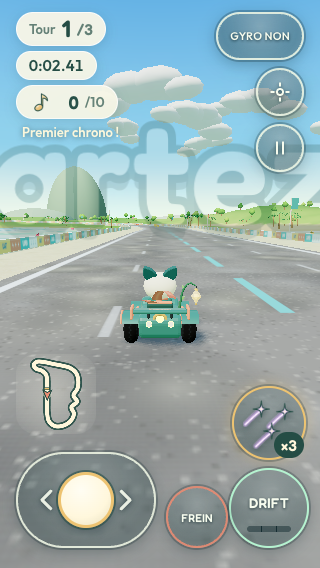
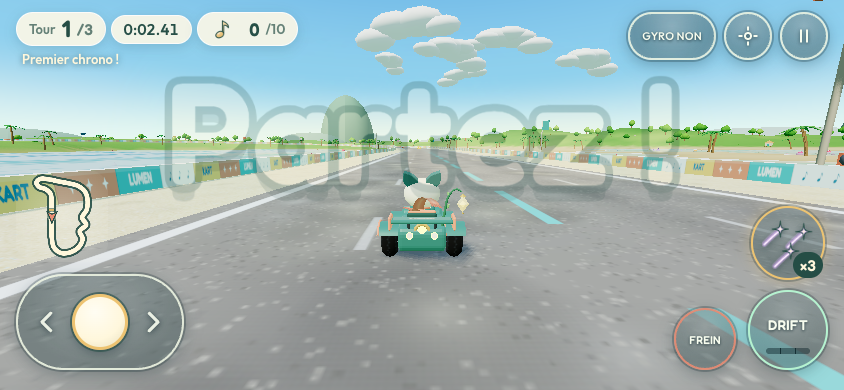
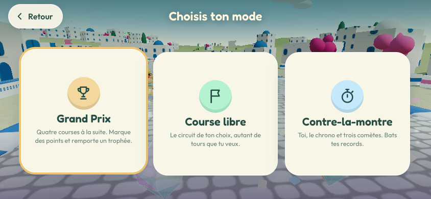
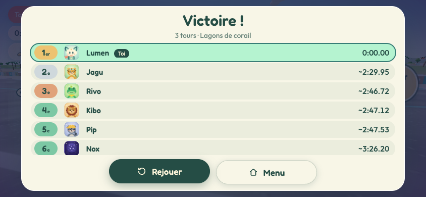
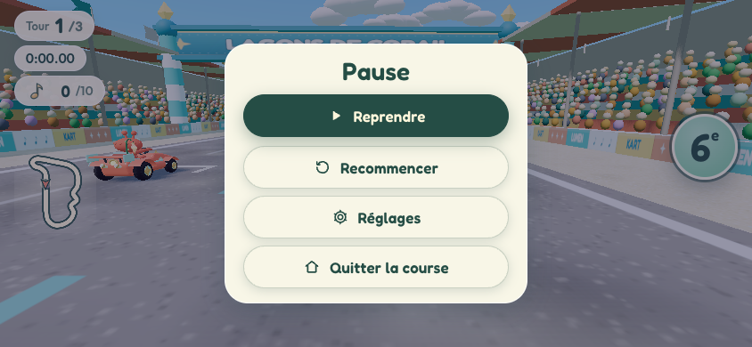
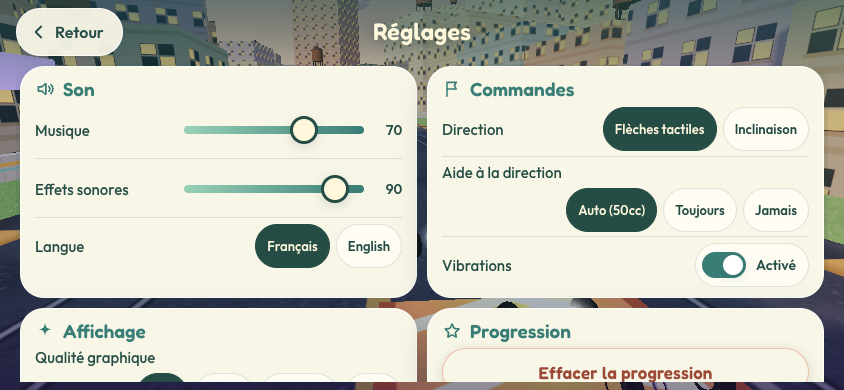
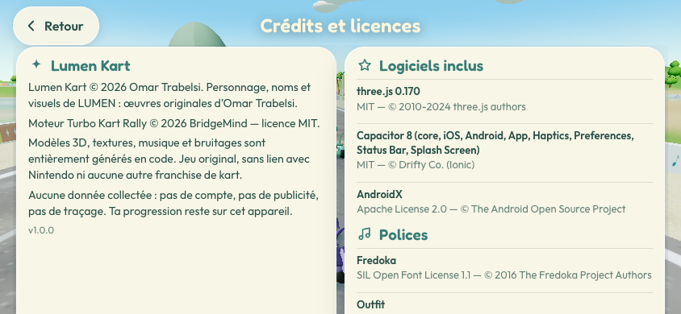

# Cockpit mobile et rendu sur téléphone

Lumen Kart est conçu **mobile d'abord** : paysage, une main par côté, centre de l'écran libre pour la piste.
Fichiers : `src/mobile-controls.js`, `src/mobile.css`, `src/hud.js`, `src/native-motion.js`, `src/settings.js`.
Rapport détaillé de l'agent UX : [`agents/ux.md`](agents/ux.md).

## Disposition (paysage)

| Zone | Contenu |
|---|---|
| Haut gauche | pilules « Tour 2/3 » (corail au dernier tour), chrono, **♪ 7/10** (doré à 10), record en contre-la-montre |
| Haut centre | emplacement d'objet (roulette, ×3) et nom de l'objet à la prise ; astuces de premier lancement |
| Haut droite | **GYRO** (inclinaison oui/non), recentrer, pause |
| Bas gauche | **pilule de direction** ‹ › à curseur ; mini-carte au-dessus |
| Bas droite | **Objet** (icône de l'objet tenu), **Drift** (jauge de charge en 3 segments), **Frein** ; badge de position au-dessus |

- **Accélération automatique** dès le « Partez ! » ; elle est exclue de la détection du départ fusée, donc jamais
  pénalisante pendant le compte à rebours.
- Style « disques de verre » de LUMEN ; cibles **≥ 48 px** ; multi-touch avec capture de pointeur ; tout appui
  interrompu (annulation, perte de focus, changement d'état) est relâché.
- Annonces (figure, aspiration, ultra mini-turbo…) placées **sous** le kart pour libérer le centre.
- Zones sûres : `env(safe-area-inset-*)` **et** `--safe-area-inset-*` injectées par Capacitor sur Android.
- Vérifié sans chevauchement à 844×390, 932×430, 667×375, 568×320 (iPhone SE 1re gén., badge de position réduit)
  et 320×568 ; la suite Playwright garde ces tailles sous surveillance.
- Les navigateurs en portrait ont une mise en page dédiée (choix du pilote, cockpit) ; les apps natives sont
  verrouillées en paysage.

| Portrait 320×568 (navigateur) | Contre-la-montre 844×390 |
|---|---|
|  |  |

## Direction

- **Tactile** (défaut) : glisser le curseur de la pilule ; zone morte de 6 px, plein braquage à 60 px, courbe
  progressive. La rampe de direction du kart joueur (0,09 s) adoucit les entrées numériques.
- **Inclinaison** (réglage « Direction » ou bouton GYRO) : CoreMotion sur iOS et capteur de gravité Android (repli
  accéléromètre filtré) via le plugin natif `TiltMotion` ; `DeviceOrientation` dans le navigateur (HTTPS ou localhost).
  L'autorisation est demandée depuis un geste du joueur (« C'est parti ! »), jamais au chargement. La première lecture
  devient le neutre ; zone morte de 2°, plein braquage à **24°** d'inclinaison relative ; recalibrage au changement
  d'orientation ou via le bouton recentrer. Le tactile reste prioritaire et toujours disponible (autorisation refusée,
  capteur absent).
- **Aide à la direction** : Auto (50cc) / Toujours / Jamais — voir [`GAMEPLAY.md`](GAMEPLAY.md#aide-à-la-direction).

## Comportement d'app mobile

- Pause automatique sur `visibilitychange`, `pagehide` et `App.pause` ; l'AudioContext est suspendu en arrière-plan
  et repris au retour ; l'audio est débloqué au premier appui.
- **Bouton retour Android** : menus → écran précédent ; course → pause ; pause → reprise ; titre → quitter.
- Zoom, défilement, appui long et menus contextuels bloqués (`user-scalable=no`, `touch-action`,
  `-webkit-touch-callout`, `gesturestart`).
- **Vibrations** (réglage « Vibrations ») sur les chocs, mini-turbos, boosts, atterrissages et objets qui touchent,
  limitées à une toutes les 60–90 ms.

## Rendu et performances

La physique tourne par pas fixes de 1/60 s, indépendamment du rendu. Le rendu s'adapte à l'appareil :

| Qualité | Pixel ratio (mobile) | Ombres | Bloom | Karts | Décor |
|---|---|---|---|---|---|
| Haute | ≤ 1,5 | douces | non (bureau seulement) | ≤ 12 k triangles | 100 % |
| Moyenne | ≤ 1,25 | PCF | non | ≤ 6 k triangles | 60 % |
| Basse | ≤ 1 | aucune (ombres-disques) | non | ≤ 3 k triangles | 35 % |

- **Auto** (défaut) : téléphone → Moyenne, ou Basse si ≤ 3 Go de RAM ou ≤ 4 cœurs. En course, sous 40 i/s pendant 4 s,
  la résolution baisse par paliers de 15 % (jusqu'à 60 %).
- **Réduire les effets** : pas de lignes de vitesse, secousses de caméra à 25 %, animations d'interface coupées.
- « Afficher les i/s » affiche un compteur discret pour les tests sur appareil.
- Natif : écran maintenu allumé, 120 Hz autorisé sur iPhone ProMotion, mode performance soutenue sur Android.

La fréquence d'images et l'ergonomie sur **appareils physiques** restent à valider avant la soumission
(check-list : [`../store/RELEASE_CHECKLIST.md`](../store/RELEASE_CHECKLIST.md)).

## Autres captures

| Titre | Modes | Résultats |
|---|---|---|
|  |  |  |
| **Pause** | **Réglages** | **Crédits** |
|  |  |  |
